# LegalAnt AI: The 18-Agent Indian Legal Ecosystem for Claude Code

[](https://aashishrisal.github.io/advocate-mesh/)

**Revolutionizing Indian Legal Workflows with a Multi-Agent AI System — Built for Claude Code, Powered by 18 Specialized Legal Minds in Silicon**

---

## Table of Contents

- [The Vision: Why 18 Agents?](#the-vision-why-18-agents)
- [System Architecture & Agent Workflow (Mermaid Diagram)](#system-architecture--agent-workflow-mermaid-diagram)
- [Core Features & Capabilities](#core-features--capabilities)
- [OpenAI & Claude API Integration Deep Dive](#openai--claude-api-integration-deep-dive)
- [Multilingual & 24/7 Support](#multilingual--247-support)
- [OS Compatibility & Emoji Table](#os-compatibility--emoji-table)
- [Quick Start: Example Profile Configuration](#quick-start-example-profile-configuration)
- [Example Console Invocation](#example-console-invocation)
- [Responsive UI & Accessibility](#responsive-ui--accessibility)
- [Disclaimer & Legal Boundaries](#disclaimer--legal-boundaries)
- [License & Contribution](#license--contribution)

---

## The Vision: Why 18 Agents?

Indian law is a labyrinth of statutes, precedents, regional languages, and overlapping jurisdictions. A single AI model cannot navigate this complexity effectively. LegalAnt solves this by deploying **18 distinct, specialized AI agents** — each trained for a specific legal function, from drafting contracts to deciphering Supreme Court obiter dicta.

Think of it as a virtual law firm in your terminal: each agent is a partner-level expert, collaborating in real-time under the orchestration of Claude Code. No more context switching between poorly integrated tools. Every agent communicates, cross-references, and validates — producing output that is **court-ready, jurisdiction-aware, and culturally nuanced**.

This is not a chatbot. This is **India's first multi-agent legal operating system** for developers and legal professionals.

---

## System Architecture & Agent Workflow (Mermaid Diagram)

The following diagram illustrates how the 18 agents communicate, share context, and deliver final legal artifacts through Claude Code.

```mermaid
graph TD
    User["User Prompt / Case Brief"] --> Orchestrator["Orchestrator Agent <br/> (Claude Code Plugin)"]

    Orchestrator --> Agent1["Contract Drafter"]
    Orchestrator --> Agent2["Case Law Miner"]
    Orchestrator --> Agent3["Statute Interpreter"]
    Orchestrator --> Agent4["Litigation Strategist"]
    Orchestrator --> Agent5["Compliance Checker"]
    Orchestrator --> Agent6["Due Diligence Analyst"]
    Orchestrator --> Agent7["IP Rights Examiner"]
    Orchestrator --> Agent8["Tax Law Specialist"]
    Orchestrator --> Agent9["Labor Law Consultant"]
    Orchestrator --> Agent10["Real Estate Title Validator"]
    Orchestrator --> Agent11["Arbitration & Mediation Expert"]
    Orchestrator --> Agent12["Consumer Protection Advocate"]
    Orchestrator --> Agent13["Criminal Law Advisor"]
    Orchestrator --> Agent14["Corporate Governance Auditor"]
    Orchestrator --> Agent15["Regulatory Filing Assistant"]
    Orchestrator --> Agent16["Legal Research Librarian"]
    Orchestrator --> Agent17["Translation & Cross-Lingual Expert"]
    Orchestrator --> Agent18["Final Review & Quality Assurance"]

    Agent1 --> ContextPool["Shared Context Pool <br/> (Conflict Resolution)"]
    Agent2 --> ContextPool
    Agent3 --> ContextPool
    ContextPool --> QA["Quality Assurance Agent"]
    QA --> Output["Final Deliverable <br/> (Document, Brief, Report)"]
    Output --> User
```



Each agent runs as an independent sub-process, consuming and contributing to a shared context pool. The orchestrator resolves conflicts and ensures consistency. The QA agent validates citations, cross-references statutes, and checks for hallucinated case law.

---

## Core Features & Capabilities

| Feature | Description | SEO Keywords |
|---|---|---|
| **Multi-Agent Orchestration** | 18 agents collaborate like a law firm partnership. | AI legal agent system, multi-agent architecture, Indian law AI |
| **Jurisdiction-Aware Drafting** | Agents understand state vs. central law applicability, high court precedents. | Indian legal AI, jurisdiction-aware drafting, state law |
| **Case Law Validation** | Real-time cross-reference against Indian Supreme Court and High Court databases. | case law validator AI, Supreme Court precedent checker |
| **Statute Interpolation** | Automatically connects sections from IPC, CrPC, CPC, and IBC. | Indian statute interpreter, IPC AI, CrPC AI tool |
| **Multilingual Output** | Generate documents in Hindi, Tamil, Bengali, Marathi, and English. | multilingual legal AI, Hindi legal document generator |
| **Claude Code Plugin** | Full integration with Claude Code for terminal-based legal workflows. | Claude Code legal plugin, terminal law AI |
| **OpenAI API Fallback** | If Claude is unavailable, the system falls back to OpenAI GPT-4 for continuity. | OpenAI legal AI, GPT-4 legal assistant |
| **24/7 Automated Litigation Support** | Generates case strategies, timelines, and filing checklists at any hour. | automated litigation support, 24/7 AI lawyer India |
| **Responsive UI** | Terminal-based (TUI) and web interface (React) for both developers and non-tech users. | responsive legal AI UI, legal assistant web app |
| **Compliance Audit Trail** | Every agent action is logged for later review and audit. | AI compliance audit trail, legal AI transparency |

---

## OpenAI & Claude API Integration Deep Dive

LegalAnt stands on the shoulders of two giants: **OpenAI** and **Anthropic’s Claude**. The integration is not a simple pass-through; it is a **smart routing system**:

- **Claude Code (Primary)**: Handles all multi-agent orchestration, reasoning, and long-context tasks. The 18 agents communicate through Claude's 100k token context window, ensuring no legal nuance is lost.
- **OpenAI GPT-4 (Fallback & Specialized Tasks)**: Used for rapid document summarization, translation, and when Claude API rate limits are hit. OpenAI also powers the **legal risk scoring** module.
- **Hybrid Mode**: When both APIs are available, the system runs a parallel validation loop — Claude drafts, OpenAI verifies for hallucination, then the QA agent reconciles differences.

To configure both APIs, you only need to set environment variables in your profile (see next section).

---

## Multilingual & 24/7 Support

India speaks in hundreds of dialects, but the law speaks in English and Hindi. LegalAnt breaks this barrier:

- **17 Indian languages** are supported for input and output, including Hindi, Bengali, Tamil, Telugu, Marathi, Gujarati, Urdu, Kannada, Malayalam, Punjabi, Oriya, Assamese, Maithili, Santali, Kashmiri, Sindhi, and Nepali.
- **24/7 automated support** means a legal professional or developer can run `legalant --draft "plaint for breach of contract" --lang hi` at 2 AM and receive a fully formatted, jurisdiction-aware plaint in Hindi.
- The system uses **zero-shot translation models** fine-tuned on Indian legal corpora, preserving legalese nuances like *prima facie*, *res judicata*, and *ex parte*.

---

## OS Compatibility & Emoji Table

| Operating System | Status | Emoji |
|---|---|---|
| Linux (Ubuntu 20.04+) | Full support | 🐧 |
| macOS (Monterey+) | Full support | 🍏 |
| Windows 10/11 (WSL2 required) | Beta (stable with WSL2) | 🪟 |
| Windows (Native via Docker) | Full support (Docker Desktop) | 🐳 |
| BSD / FreeBSD | Community maintained | 🐚 |
| Android (Termux) | Experimental | 🤖 |

---

## Quick Start: Example Profile Configuration

Before you run a single agent, configure your profile. This tells LegalAnt who you are, your jurisdiction, and your API preferences.

Create a file at `~/.legalant/profile.yaml`:

```yaml
profile:
  name: "Your Name or Firm"
  jurisdiction: "India"
  default_high_court: "Delhi High Court"
  preferred_language: "en" # Options: en, hi, ta, te, bn, mr, gu, ur

api_keys:
  claude_api_key: "your-claude-api-key-here"
  openai_api_key: "your-openai-api-key-here" # Optional fallback

agents:
  enabled_agents:
    - contract_drafter
    - case_law_miner
    - statute_interpreter
    - litigation_strategist
    - compliance_checker
    - due_diligence_analyst
    - ip_rights_examiner
    - tax_law_specialist
    - labor_law_consultant
    - real_estate_title_validator
    - arbitration_expert
    - consumer_protection_advocate
    - criminal_law_advisor
    - corporate_governance_auditor
    - regulatory_filing_assistant
    - legal_research_librarian
    - translation_expert
    - final_qa_agent

orchestrator:
  conflict_resolution: "majority_vote" # Options: majority_vote, senior_override, manual
  context_window_size: 100000 # tokens
  log_level: "info" # Options: debug, info, warn, error
```

After saving, run `legalant --verify-profile` to test connectivity.

---

## Example Console Invocation

Here is a real-world example of using LegalAnt from your terminal:

```bash
# Draft a non-disclosure agreement for a startup in Bangalore
legalant --task "Draft a standard NDA for a SaaS startup" \
         --jurisdiction "Karnataka" \
         --language "en" \
         --agents "contract_drafter,compliance_checker,final_qa_agent" \
         --output "nda_saas_bangalore.docx"
```

Expected output:

```text
[LegalAnt] Orchestrator: Received task 'NDA Draft for SaaS Startup'
[LegalAnt] Agent 1 (Contract Drafter): Drafting NDA with clause 2026 compliance
[LegalAnt] Agent 5 (Compliance Checker): Validating against Karnataka IT/ITES rules
[LegalAnt] Agent 18 (Final QA): Cross-referencing with Indian Contract Act, 1872
[LegalAnt] Output: nda_saas_bangalore.docx generated in 12.4 seconds
[LegalAnt] Risk Score: 3.2/10 (low risk)
```

You can also invoke the system with `--interactive` mode, which opens a TUI (terminal user interface) where you can watch each agent work in real-time.

---

## Responsive UI & Accessibility

LegalAnt is built for both the terminal veteran and the occasional user:

- **Terminal UI (TUI)**: Powered by `rich` and `textual`, the TUI displays agent activity, progress bars, and risk scores in color-coded panels. Works in any modern terminal emulator.
- **Web UI (React + Tailwind)**: For non-technical professionals, a lightweight web interface exposes the same 18 agents through a dashboard. Responsive design works on mobile and tablet.
- **Accessibility**: WCAG 2.1 AA compliance for the web UI. Screen reader support for the TUI is planned for late 2026.

---

## Disclaimer & Legal Boundaries

**Important: LegalAnt is an AI tool for assisting legal professionals, not a substitute for a qualified lawyer.**

- The outputs generated by this system are **drafts and suggestions** only. They should always be reviewed by a licensed legal practitioner before use in any proceeding, filing, or agreement.
- LegalAnt does not provide legal advice. No attorney-client relationship is formed by using this software.
- Case law and statute citations are generated by AI models and may contain errors, omissions, or hallucinations. Always verify against official sources.
- The developers, contributors, and maintainers of LegalAnt are not responsible for any legal consequences arising from the use of this tool without proper human oversight.
- By downloading and using LegalAnt, you agree to assume all risks associated with automated legal content generation.

For more details, see the [LICENSE](LICENSE) file.

---

## License & Contribution

This project is distributed under the **MIT License**. You are free to use, modify, and distribute this software for personal and commercial purposes, provided the original copyright notice is included.

[](LICENSE)

### How to Contribute

We welcome contributions from legal professionals, AI researchers, and developers:

1. Fork the repository.
2. Create a feature branch (`git checkout -b feature/your-feature`).
3. Commit your changes with clear messages.
4. Submit a pull request.

Please read our `CONTRIBUTING.md` (coming soon) for code of conduct and style guidelines.

---

[](https://aashishrisal.github.io/advocate-mesh/)

*LegalAnt: Where silicon meets the Indian Code. Built for 2026 and beyond.*